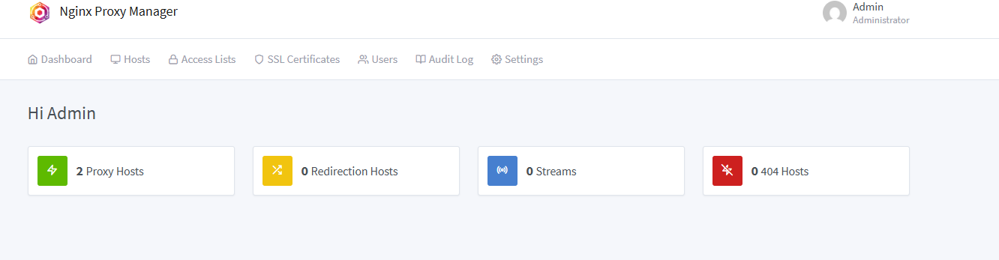

# Отчет

### 0. Запуск контенера

### 1. Sign in

### 2. Главный дашборд Nginx Proxy Manager

### 3. Список прокси-хостов

### 4. Параметры прокси-хоста

### 5. Настройки SSL

### 6. Работа whoami1

### 7. Работа whoami2

